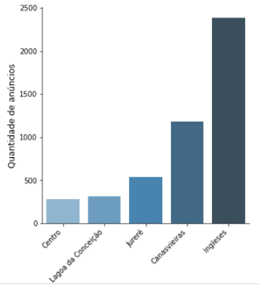

 

# 🚀 Seazone Code Challenge - Data Science

## 💻 Código completo no Colab

## 📝 Descrição do desafio

O desafio consiste em analisar os dados de ocupação e preço de anúncios no Airbnb em Florianópolis-SC, mais especificamente nos bairros: Canasvieiras, Centro, Ingleses, Jurerê e Lagoa da Conceição.

Deseja-se:

1.  Ordenar os bairros em ordem crescente de número de anúncios (*airbnb_listing_id*);
2.  Ordenar os bairros em ordem crescente de faturamento médio dos anúncios (*airbnb_listing_id*);
3.  Verificar se há correlações entre as características de um anúncio e seu faturamento.
4.  Calcular a antecedência média das reservas e se esse número é maior ou menor no caso de reservas para os finais de semana.  

## 📊 Resultados

### 1 - Ordenar os bairros em ordem crescente de número de anúncios (*airbnb_listing_id*)

#### Tabela 1 - Nº de anúncios por bairro
|Bairro| Nº de anúncios|
|--|--|
|Centro|278|
|Lagoa da Conceição|309|
|Jurerê|539|
|Canasvieiras|1177|
|Ingleses|2388|

#### Figura 1 - Nº de anúncios por bairro

### 2 - Ordenar os bairros em ordem crescente de faturamento médio dos anúncios (*airbnb_listing_id*)
### 3 - Verificar se há correlações entre as características de um anúncio e seu faturamento
### 4 - Verificar qual antecedência média das reservas e se esse número é maior ou menor no caso de reservas para os finais de semana

